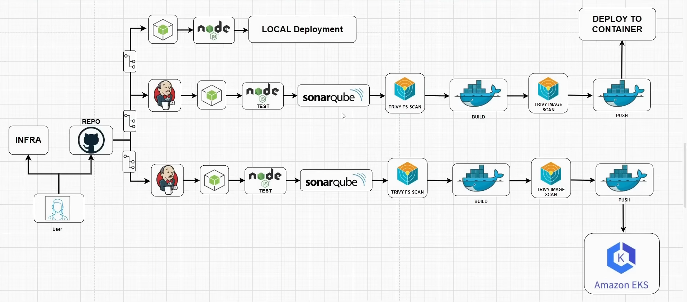

# CI/CD Deployment Pipeline with Jenkins on AWS

This repository documents the process of creating a comprehensive CI/CD pipeline using Jenkins. The guide covers three distinct deployment strategies: **Local**, **Development**, and **Production** on AWS Elastic Kubernetes Service (EKS).



## Table of Contents
1.  [Local Deployment](#1-local-deployment)
2.  [Development Deployment (CI/CD with Jenkins & SonarQube)](#2-development-deployment-cicd-with-jenkins--sonarqube)
3.  [Production Deployment (Kubernetes on AWS EKS)](#3-production-deployment-kubernetes-on-aws-eks)

---

## 1. Local Deployment

This method involves manually deploying the application to a single AWS EC2 instance. It's useful for quick tests and basic setups.

### Steps

1.  **Create an AWS EC2 Instance**
    * Log in to your AWS console and launch a new EC2 instance (e.g., Ubuntu 22.04). Ensure the security group allows SSH (port 22) and the application port (e.g., port 3000) from your IP address.

2.  **Connect and Run the Application**
    * SSH into your newly created instance.
    * Run the following commands to clone the repository and start the application:

    ```bash
    # Update package lists
    sudo apt update

    # Clone your project repository
    git clone <YOUR_REPO_URL>

    # Change into the project directory
    cd <YOUR_REPO_DIRECTORY>

    # Install Node.js (example for Node.js projects)
    curl -fsSL [https://deb.nodesource.com/setup_18.x](https://deb.nodesource.com/setup_18.x) | sudo -E bash -
    sudo apt-get install -y nodejs

    # Install project dependencies
    npm install

    # Run the application (example command)
    npm start
    ```

3.  **Add Environment Variables**
    * If your application requires environment variables (e.g., database URLs, API keys), create a `.env` file or export them in the terminal before running the application.

4.  **Access the Application**
    * Copy the Public IP address of your EC2 instance from the AWS console.
    * Open your web browser and navigate to `http://<EC2_PUBLIC_IP>:<PORT>` (e.g., `http://54.123.45.67:3000`). Your application should now be live.

---

## 2. Development Deployment (CI/CD with Jenkins & SonarQube)

This setup automates the build, test, and analysis process using Jenkins for continuous integration and SonarQube for code quality analysis.

### 2.1 Infrastructure Setup

1.  **Create two AWS EC2 Instances**:
    * `Jenkins-Server`: This will host the Jenkins CI/CD tool.
    * `SonarQube-Server`: This will host the SonarQube code analysis tool.
    * Ensure their respective security groups allow traffic on ports `8080` (for Jenkins) and `9000` (for SonarQube).

### 2.2 Jenkins Server Setup

1.  **SSH into the `Jenkins-Server` instance** and run the following commands:
    ```bash
    # Update package lists
    sudo apt update

    # Install Java (required for Jenkins)
    sudo apt install openjdk-11-jre -y

    # Install Jenkins
    curl -fsSL [https://pkg.jenkins.io/debian-stable/jenkins.io-2023.key](https://pkg.jenkins.io/debian-stable/jenkins.io-2023.key) | sudo tee \
      /usr/share/keyrings/jenkins-keyring.asc > /dev/null
    echo deb [signed-by=/usr/share/keyrings/jenkins-keyring.asc] \
      [https://pkg.jenkins.io/debian-stable](https://pkg.jenkins.io/debian-stable) binary/ | sudo tee \
      /etc/apt/sources.list.d/jenkins.list > /dev/null
    sudo apt-get update
    sudo apt-get install jenkins -y

    # Install Docker
    sudo apt install docker.io -y
    sudo systemctl start docker
    sudo systemctl enable docker
    ```

2.  **Configure Jenkins and Docker Permissions**:
    * Get the initial administrator password for Jenkins:
        ```bash
        sudo cat /var/lib/jenkins/secrets/initialAdminPassword
        ```
    * Give the `jenkins` user permission to run Docker commands:
        ```bash
        sudo usermod -aG docker jenkins
        sudo systemctl restart jenkins
        ```
        *(Note: You may need to log out and log back in or restart the Jenkins service for this to take effect.)*

3.  **Complete Jenkins Setup**:
    * Open your browser and navigate to `http://<JENKINS_SERVER_IP>:8080`.
    * Paste the administrator password and follow the on-screen instructions to install suggested plugins.

### 2.3 SonarQube Server Setup

1.  **SSH into the `SonarQube-Server` instance** and run the following commands:
    ```bash
    # Update package lists
    sudo apt update

    # Install Docker
    sudo apt install docker.io -y
    sudo systemctl start docker
    sudo systemctl enable docker
    ```
2.  **Run SonarQube Container**:
    * Run the official SonarQube image in a Docker container:
        ```bash
        docker run -d --name sonarqube -p 9000:9000 sonarqube:lts-community
        ```
3.  **Access SonarQube**:
    * Navigate to `http://<SONARQUBE_SERVER_IP>:9000`.
    * Log in with the default credentials: **username**: `admin`, **password**: `admin`. You will be prompted to change the password.

### 2.4 Jenkins Configuration for CI/CD

1.  **Install Essential Jenkins Plugins**:
    * In Jenkins, go to `Manage Jenkins` > `Plugins`.
    * Install the following plugins: `NodeJS`, `Docker`, `Docker Pipeline`, `SonarQube Scanner for Jenkins`.

2.  **Install Trivy (Vulnerability Scanner)**:
    * Trivy is not a Jenkins plugin. You must install it directly on the `Jenkins-Server` EC2 instance.
    ```bash
    # SSH into Jenkins-Server
    sudo apt-get install wget apt-transport-https gnupg lsb-release -y
    wget -qO - [https://aquasecurity.github.io/trivy-repo/deb/public.key](https://aquasecurity.github.io/trivy-repo/deb/public.key) | sudo apt-key add -
    echo deb [https://aquasecurity.github.io/trivy-repo/deb](https://aquasecurity.github.io/trivy-repo/deb) $(lsb_release -sc) main | sudo tee -a /etc/apt/sources.list.d/trivy.list
    sudo apt-get update
    sudo apt-get install trivy -y
    ```

3.  **Configure Jenkins Tools**:
    * Go to `Manage Jenkins` > `Tools`.
    * Configure installations for **NodeJS** and **Docker**.

4.  **Connect Jenkins to SonarQube**:
    * **In SonarQube**: Go to `Administration` > `Security` > `Users` and generate a new token for Jenkins.
    * **In Jenkins**:
        * Go to `Manage Jenkins` > `Credentials` > `System` > `Global credentials`.
        * Add new credentials:
            * **Kind**: `Secret text`
            * **Secret**: Paste the SonarQube token.
            * **ID**: `sonarqube-token` (or a name of your choice).
        * Go to `Manage Jenkins` > `System`.
        * Under `SonarQube servers`, add a new server:
            * **Name**: `SonarQube`
            * **Server URL**: `http://<SONARQUBE_SERVER_IP>:9000`
            * **Server authentication token**: Select the `sonarqube-token` credential you just created.

5.  **Add GitHub and Docker Hub Credentials to Jenkins**:
    * **GitHub**: If your repository is private, create a **Personal Access Token (PAT)** in GitHub (`Settings` > `Developer settings`).
    * **Docker Hub**: Use your Docker Hub username and password/access token.
    * In Jenkins, go to `Manage Jenkins` > `Credentials` > `System` > `Global credentials` and add credentials for both GitHub and Docker Hub (**Kind**: `Username with password`).

### 2.5 Create and Run the Jenkins Pipeline

1.  **Create a New Pipeline Job** in Jenkins.
2.  **Configure the Pipeline Script**:
    * In the pipeline configuration, select `Pipeline script from SCM`.
    * **SCM**: `Git`
    * **Repository URL**: Your project's repository URL.
    * **Credentials**: Select your GitHub credentials.
    * **Script Path**: `Jenkinsfile` (assuming your pipeline script is named this).
3.  **Write your `Jenkinsfile`**:
    * Define stages for **Checkout**, **Build**, **Test**, **Code Analysis (SonarQube)**, **Security Scan (Trivy)**, and **Docker Build & Push**.
    * Use the **Snippet Generator** in Jenkins to create the correct syntax for checking out code with credentials, running SonarQube analysis, and pushing Docker images.

4.  **Build the Pipeline**: Click `Build Now` to run your automated development pipeline.

---

## 3. Production Deployment (Kubernetes on AWS EKS)

This final stage deploys the containerized application to a scalable and resilient Kubernetes cluster managed by AWS EKS.

### 3.1 Prepare the Jenkins Server

1.  **SSH into your `Jenkins-Server` instance**.
2.  **Install AWS and Kubernetes CLIs**:
    ```bash
    # Install AWS CLI
    curl "[https://awscli.amazonaws.com/awscli-exe-linux-x86_64.zip](https://awscli.amazonaws.com/awscli-exe-linux-x86_64.zip)" -o "awscliv2.zip"
    unzip awscliv2.zip
    sudo ./aws/install

    # Install kubectl
    curl -o kubectl [https://s3.us-west-2.amazonaws.com/amazon-eks/1.23.7/2022-06-29/bin/linux/amd64/kubectl](https://s3.us-west-2.amazonaws.com/amazon-eks/1.23.7/2022-06-29/bin/linux/amd64/kubectl)
    chmod +x ./kubectl
    sudo mv ./kubectl /usr/local/bin

    # Install eksctl
    curl --silent --location "[https://github.com/weaveworks/eksctl/releases/latest/download/eksctl_$(uname](https://github.com/weaveworks/eksctl/releases/latest/download/eksctl_$(uname) -s)_amd64.tar.gz" | tar xz -C /tmp
    sudo mv /tmp/eksctl /usr/local/bin
    ```
### 3.2 Configure AWS IAM and CLI

1.  **Create an IAM User for Jenkins**:
    * In the AWS IAM console, create a new user (e.g., `jenkins-eks-user`).
    * Attach the following **AWS managed policies**: `AmazonEC2FullAccess`, `IAMFullAccess`, `AmazonEKSClusterPolicy`, `AmazonEKSWorkerNodePolicy`, `AmazonEKS_CNI_Policy`, `AWSCloudFormationFullAccess`.
    * **Important**: This provides broad permissions. For a real production environment, follow the principle of least privilege and create custom, more restrictive policies.
2.  **Generate and Configure Access Keys**:
    * Create an access key for the `jenkins-eks-user`. Download and save the `Access key ID` and `Secret access key`.
    * On the `Jenkins-Server` instance, configure the AWS CLI:
        ```bash
        aws configure
        ```
        * Enter the `Access Key ID`, `Secret Access Key`, and your default AWS region.

### 3.3 Create the EKS Cluster and Node Group

1.  **Create the EKS Cluster**:
    * Run the following `eksctl` command to create the control plane.
        ```bash
        eksctl create cluster \
        --name my-eks-cluster \
        --region us-east-1 \
        --zones=us-east-1a,us-east-1b \
        --without-nodegroup
        ```
2.  **Associate IAM OIDC Provider**:
    * This allows your cluster to use IAM roles for service accounts.
        ```bash
        eksctl utils associate-iam-oidc-provider \
        --region us-east-1 \
        --cluster my-eks-cluster \
        --approve
        ```
3.  **Create a Managed Node Group**:
    * This command creates the EC2 instances (worker nodes) for your cluster.
        ```bash
        eksctl create nodegroup \
        --cluster=my-eks-cluster \
        --region=us-east-1 \
        --name=my-worker-nodes \
        --nodes=2 \
        --nodes-min=2 \
        --nodes-max=4 \
        --node-type=t3.medium \
        --managed
        ```
4.  **Verify Cluster**:
    * Update your kubeconfig file to connect `kubectl` to your new cluster.
        ```bash
        aws eks --region us-east-1 update-kubeconfig --name my-eks-cluster
        ```
    * Check that the nodes are running and ready:
        ```bash
        kubectl get nodes
        ```

### 3.4 Configure Kubernetes RBAC for Jenkins

To allow Jenkins to deploy to the cluster, you must create a Kubernetes `ServiceAccount` and bind it to a `Role` with the necessary permissions.

1.  Create a file named `jenkins-rbac.yaml`:
    ```yaml
    apiVersion: v1
    kind: ServiceAccount
    metadata:
      name: jenkins-deploy
      namespace: default
    ---
    apiVersion: rbac.authorization.k8s.io/v1
    kind: Role
    metadata:
      name: jenkins-deploy-role
      namespace: default
    rules:
    - apiGroups: ["", "apps", "extensions"]
      resources: ["deployments", "services", "pods", "ingresses"]
      verbs: ["create", "get", "update", "list", "patch", "delete"]
    ---
    apiVersion: rbac.authorization.k8s.io/v1
    kind: RoleBinding
    metadata:
      name: jenkins-deploy-binding
      namespace: default
    subjects:
    - kind: ServiceAccount
      name: jenkins-deploy
      namespace: default
    roleRef:
      kind: Role
      name: jenkins-deploy-role
      apiGroup: rbac.authorization.k8s.io
    ```
2.  Apply the RBAC configuration to your cluster:
    ```bash
    kubectl apply -f jenkins-rbac.yaml
    ```
### 3.5 Update Jenkins Pipeline for Production Deployment

1.  **Add Kubernetes Credentials to Jenkins**:
    * Get the token for the `jenkins-deploy` service account you created.
    * In Jenkins, go to `Manage Jenkins` > `Credentials` and add new credentials:
        * **Kind**: `Secret text`
        * **Secret**: Paste the token for the `jenkins-deploy` service account.
        * **ID**: `eks-deploy-token`

2.  **Add a "Deploy to Production" Stage in your `Jenkinsfile`**:
    * Use the `withKubeconfig` block (from the Kubernetes CLI plugin) to securely connect to your EKS cluster.
    * Use the **Snippet Generator** to create the correct syntax.
    * Inside this block, use `kubectl apply -f <your-deployment.yaml>` to deploy your application.

    ```groovy
    stage('Deploy to EKS') {
        steps {
            withKubeconfig([credentialsId: 'eks-deploy-token', serverUrl: 'https://<EKS_API_SERVER_ENDPOINT>']) {
                sh 'kubectl apply -f k8s/deployment.yaml'
                sh 'kubectl apply -f k8s/service.yaml'
            }
        }
    }
    ```
3.  **Build the Pipeline**: Run the pipeline again. It will now deploy your containerized application to the EKS cluster.
4.  **Verify Deployment**:
    * Check the status of your pods, deployments, and services in Kubernetes.
        ```bash
        kubectl get pods
        kubectl get deployments
        kubectl get svc
        ```
